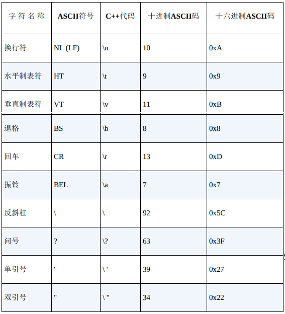
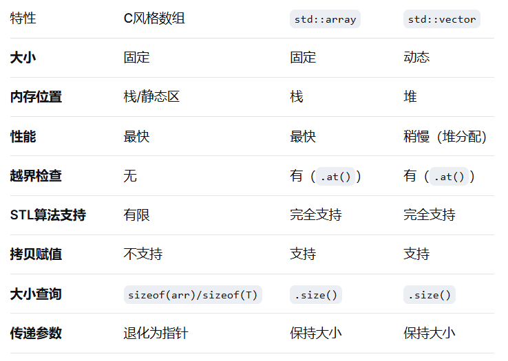
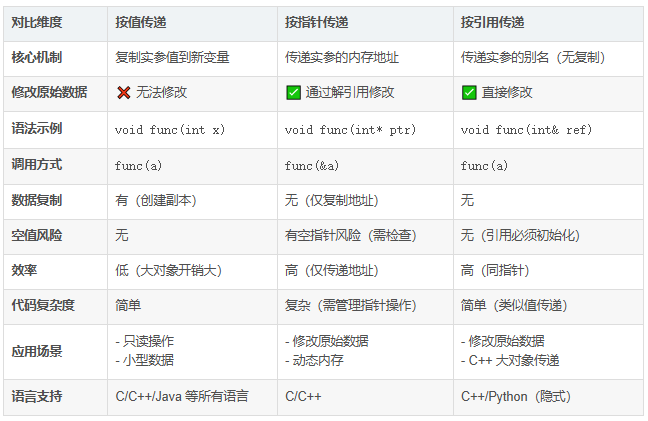
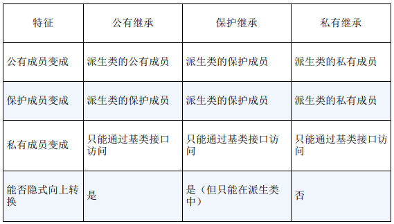
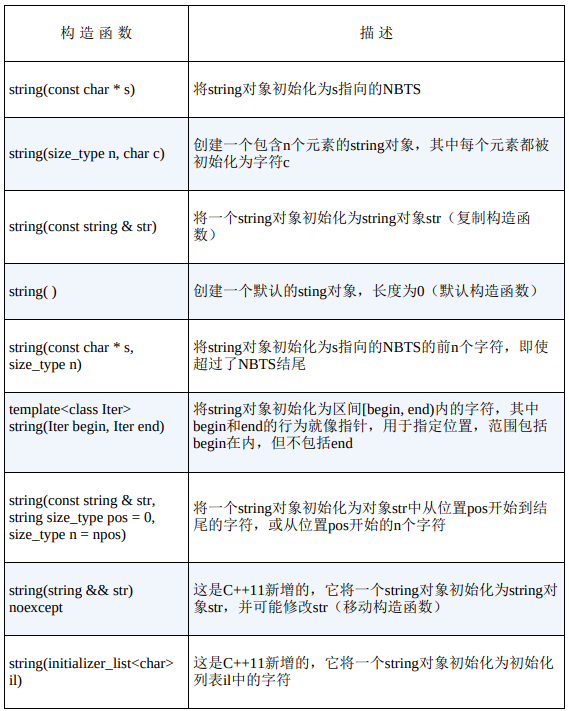
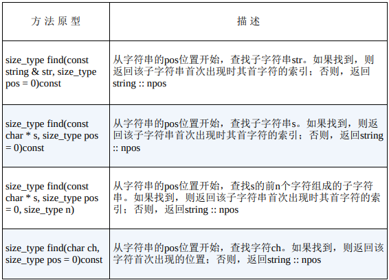

# 变量数据

## 整型变量类型选择

如果变量表示的整数值**大于16位的最大可能值**，则使用`long`

如果要存储的值**超过20e**，可以使用`long long`

仅当有大型整型数组时，才会选择使用`short`

## C++转义序列的编码



## 科学表示法

`d.dddE+n`指的是将小数点向右移动n位

`d.dddE~n`指的是将小苏点向左移动n位

## 数组的初始化规则

* 只能在声明数组时进行初始化
* 不能将数组赋值给另一个数组

## 结构体的位字段

可以通过设置结构体的位字段限制结构体成员的字节大小

```c++
struct Test {
    
    unsigned int A : 4; // 限制为4字节
}
```

## 动态内存

使用`new`分配内存，使用`delete`归还内存

```c++
int a = new int(10); // 通过()可以赋初始值
int * a = nbw int[10]; // 通过[]可以控制连续内存大小
```

归还连续的内存空间需要使用`[]`修饰

```c++
delete [] p;
```

## 数组、vector、array区别



# 函数

## 指针和const

const对指针进行修饰有两种不同的定义

```c++
const int *p1 = &num;
int const *p2 = &num;
```

* 第一种意味着指针指向的一个常量对象，**防止使用该指针来修改所指向的内容**
* 第二种意味着将指针本身声明成常量，**防止改变指针指向的位置**

## 函数指针

函数的地址是**存储其机器语言代码的内存开始地址**

````c++
void (*p)(void); // 参数返回值都是void的函数指针
````

## 内联函数

函数体（通常1-5行代码）被频繁调用时，可以使用`inline`关键字修饰

减少调用函数的消耗，但是会增加存储

```c++
inline void test();
```

## 引用变量

**引用是已定义的变量的别名**

通过`&`来声明引用

```c++
int temp = 10;
int &r = temp;
```

**引用必须在声明时进行初始化**

使用引用传递函数参数时，不需要修改数据，则应该使用常量引用

```c++
void doFun(const int &a);
```

| 情况           | 返回值类型 | 原因             |
| -------------- | ---------- | ---------------- |
| 创建新对象     | 返回值     | 必须创建新对象   |
| 链式调用       | 引用       | 连续操作同一对象 |
| 访问内部数据   | 引用       | 允许直接修改     |
| 避免大对象拷贝 | 引用       | 性能考虑         |
| 重载赋值运算符 | 引用       | 标准惯例         |
| 重载算术运算符 | 值         | 返回新对象       |

## 参数传递

* **按值传递**，函数接收的是实参的副本，函数内部对参数的修改，不会影响到函数外部的实参

  ```c++
  void swap(int x, int y) {
      
      int temp = x;
      x = y;
      y = temp;
  }
  ```

* **按指针传递**，函数接收的是实参的内存地址，函数内部可以通过该地址字节对该实参进行修改

  ```c++
  void swap(int *p1, int *p2) {
      
      int temp = *p1;
      *p1 = *p2;
      *p2 = temp;
  }
  ```

* **按引用传递**

  传递实参的别名，函数直接操作原始数据

  ```c++
  void swap(int& x, int& y) {
      
      int temp = x;
      x = y;
      y = temp;
  }
  ```



## 默认参数

默认参数是当函数调用过程中省略了实参时自动使用一个值

```c++
void test(int a, int b = 3);
```

**只需要函数原型指定默认值**，函数定义不能指定

## 函数模板

函数模板是通用的函数描述，可以泛型的定义函数

```c++
#include <iostream>

using namespace std;

template <typename AnyType>
void swap(AnyType &a, AnyType &b) {

    AnyType temp;
    temp = a;
    a = b;
    b = temp;
}
```

如果有多个函数原型，编译器在选择时，会**优先选择非模板版本**，然后**选择显式具体化版本**，最后才是**模板版本**

```c++
// 显式具体化的实现
template <typename T>
void swap(T &a, T &b);

struct Job {

    char name[40];
    double salary;
};

// 显示具体化
template <> void swap<Job>(Job &j1, Job &j2);
```

## 重载解析过程

1. **创建候选函数列表**，其中包含与被调用函数的名称相同的函数和模板函数
2. **使用候选函数列表创建可行函数列表**，可行函数列表中都是参数数目正确的函数，通过一个隐式转换序列，判断其中实参类型和相应的形参类型完全匹配的情况
3. **确定可行性**

# 类和对象

## 成员函数

定义成员函数时，**应该使用作用域解析符`::`来表示函数所属类**

使用`const`修饰成员函数，可以保证函数不能修改成员变量

```c++
class Test {
    
private:
    int a;
    
public:
    void show() const; // 确保函数不会修改成员变量
};
```

同样可以使用`inline`修饰函数，使成员函数变成内联函数

```c++
class Test {
    
public:
    void test();
};

inline void Test::test() {}
```

内联函数要求**在每个使用的文件中都需要对其进行定义**

## 析构函数

使用构造函数创建对象后，程序负责跟踪对象，生命周期结束后，程序将自动调用析构函数

```c++
~Test(); // 析构函数的声明
```

**对于父类而言，就算不需要析构函数也应该提供一个虚析构函数**

## 运算符重载

重载运算符需要使用运算符函数进行操作

```c++
operator op(argument-list); // op是需要重载的符号
```

**重载限制**

1. 重载后的运算符必须**至少有一个操作数时用户定义的类型**
2. 使用运算符时不能违反运算符原来的句法规则
3. **不能创建新运算符**
4. 不能重载以下运算符
   * `sizeof` 
   * `.`成员运算符
   * `.*`成员指针运算符
   * `::`作用域解析运算符
   * `?:`条件运算符
   * `typeid`一个RTTI运算符
   * `const_cast`强制类型转换运算符
   * `dynamic_cast`强制类型转换运算符
   * `reinterpret_cast`强制类型转换运算符
   * `static_cast`强制类型转换运算符
5. 下面的运算符**只能通过成员函数重载**
   * `=`赋值运算符
   * `()`函数调用运算符
   * `[]`下标运算符
   * `->`通过指针访问类成员的运算符

## 友元

非成员函数不能直接访问类的私有数据，但是友元函数可以

创建友元函数优先将**其原型放在类声明中**，并在原型声明中添加关键字`friend`

```c++
friend Test operator*(int a, const Test & t);
```

**在友元函数编译时，不需要添加关键字`friend`，也不需要使用作用域解析运算符**

## 转换函数

用户定义的强制类型转换就是转换函数

```c++
operator typeName(); // operator int();
```

* 转换函数必须是**类方法**
* 转换函数不能指定返回值，不能有参数

可以使用`explicit`关键字进行修饰，禁止隐形转换

```c++
class Star {
    ...
public:
    explicit Star(const char *);
    ...
};
...
Star north;
north = "hhh"; // 隐式转换不允许
north = Star("hhh"); // 显式转换允许
```

# 继承

## 派生类

```c++
class RateddPlayer : public TableTennisPlayer {
    ...
}
```

这种方式属于是公有派生，**基类的公有成员将成为派生类的公有成员**，基类的私有部分也将成为派生类的一部分，**但只能通过基类的公有和保护方法访问**

派生类的构造函数**必须给新成员（如果有）和继承的成员提供数据**

 基类指针和引用可以**不进行显式类型转换**指向派生类指针和引用

**但是基类指针和引用只能调用基类方法**

## 多态公有继承

同一个方法在派生类和基类的行为是不同的，这种机制成为多态

* 在派生类中重新定义基类的方法

* **使用虚函数**

  使用关键字`virtual`声明的方法成为虚方法

  如果没有使用`virtual`，程序**将根据引用类型或指针类型选择方法**

  如果使用`virtual`，程序将**根据引用或指针指向的对象的类型来选择方法**

## 虚函数

使用虚析构函数可以**确保正确的析构函数序列被调用**

**C++默认是静态绑定**，C++使用`virtual`关键字将函数声明为虚函数，这样就会进行动态绑定

为使程序能够在运行阶段进行决策，必须采用一些方法来跟踪基类指针或引用指向的对象类型，这增加了额外的处理开销

编译器处理虚函数对的方法是：给每个对象添加一个隐藏成员，隐藏成员中保存了一个指向函数地址数组的指针，这个数组成为虚函数表

如果派生类没有重新定义虚函数，虚函数表就保存原始版本函数地址，如果重新定义虚函数，就只想新的函数地址

**如果定义的类将被用作基类，则应将那些要在派生类中重新定义的类方法声明为虚**

## 抽象基类

抽象基类的定义是**至少有一个纯虚函数**

```c++
virtual void doFun(double amt) = 0 // 纯虚函数的声明
```

继承抽象基类的子类**必须强制重写父类的虚函数**

## 动态内存

* 父类使用动态内存，子类不使用，这种情况没有问题，子类不需要额外重写方法
* 父类不适用动态内存，子类使用，这种情况下**必须为子类额外定义析构函数、复制构造函数和赋值运算符**
* 当父类和子类都采用动态内存分配时，派生类的析构函数、复制构造函数、赋值运算符都必须使用相应的基类方法来处理基类元素

如果类包含指针成员，则**必须初始化这些成员**

## 编译器生成的函数

* 默认构造函数

  如果没有定义任何构造函数，编译器将定义默认构造函数

  **默认构造函数是没有参数的**

  系统生成的默认构造函数**会调用基类的默认构造函数**

  如果子类构造函数的成员初始化列表中没有显式调用父类的构造函数，**则编译器将使用父类的默认构造函数来构造子类对象的父类部分**，这种情况下如果父类没有所需的构造函数，那么就会报错

* 复制构造函数

  默认复制构造函数只能进行**浅拷贝**

  * 将新的对象初始化为一个同类对象
  * 按值将对象传递给函数
  * 函数按值返回对象
  * 编译器生成临时对象

  上述情况需要使用复制构造函数

* 赋值运算符

  默认赋值为成员赋值，如果成员为类对象，则默认成员赋值需要使用相应类的赋值运算符

# 模板类

## 私有继承

使用私有继承，基类的公有成员和保护成员都将**成为派生类的私有成员**

包含（has-a）是将对象作为一个命名的成员对象添加到类中

私有继承将对象作为一个未被命名的继承对象添加到类中

```c++
class Test : private a, private b {}
```

使用多个基类的继承被成为**多重继承**

## 保护继承

```c++
class Test : protected a, protected b {};
```

使用保护继承时，基类的公有成员和保护成员都会成为派生类的保护成员



## using重新定义访问权限

在保护继承或私有继承的情况下，如果要基类的方法可以在派生类外使用，可以通过两种方法实现

* 定义一个公有派生类方法，在其中使用该基类方法

* 将韩素华调用包装在另一个函数调用中，使用`using`声明来指出派生类可以使用特定的基类成员

  ```c++
  class Test : private a, private b {
      
  public:
      using a::func;
  }
  ```

## 多重继承

### 虚基类

虚基类使得从多个类（它们的基类相同）派生出的对象只继承一个基类对象

```c++
class A : virtual public B {};
```

C++在基类是虚是，禁止信息通过中间类自动传递给基类

```c++
class A {
    int a;
public:
    A(A a) : a(a) {}
};
class B : virtual public A {
    int b;
public:
    B(A, int b) : A(a), b(b) {}
};
class C : virtual public A {
    int c;
public:
    C(A a, int c) : A(a), c(c) {}
};
class D : public B, public C {
public:
    // B和C的构造函数同时初始化了基类A中a的值
    D(A & a, int b, int c) : B(a, b), C(a, c) {};
}
```

上述构造函数将初始化成员b和c，但是a参数中的信息将不会传递给子对象

**编译器必须在构造派生对象之前构造基类对象组件**

可以显式的调用所需的基类构造函数

```c++
D(const A & a, int b, int c) : A(a), B(a, b), C(a, c) {}
```

对于虚基类这种方式是合法的，**但是对于非虚基类，这种方式就是非法的**

## 类模板

使用`template`声明一个模板类

```c++
template <typename Type> // 也可以将typename换成class
```

可以使用模板成员函数操作类方法，同样使用`template`关键字

```c++
template <typename Type>
class A {
    
    Type a;
public:
	Type getA();     
};

template <typename Type>
Type A:getA() {}
```

使用所需的具体类型替换泛型名，来声明一个类型为模板类的对象

```c++
A<int> a;
```

## 表达式参数

可以在声明模板类时，同时声明多个模板参数

```c++
template <typename T, int n>
```

上述情况就是，声明T为类型参数，并且指出n的类型是int，可以在模板类实现中使用n

n在模板类声明中被称为非类型或表达式参数

表达式参数可以是**整型、枚举、引用或指针**

**表达式参数的值必须是常量表达式**

> **表达是模板的主要缺点在于**
>
> 每个数组大小不同都将生成自己的模板
>
> **所以更推荐使用构造函数指定数组大小**

## 多功能性

* 嵌套使用

  ```c++
  template <typename T>
  class A {
      
  }
  template <typename T>
  class B {
      
  }
  A<B<int>> a;
  ```

* 递归使用

  ```c++
  template <typename T>
  class A {
      T arr[];
  }
  A<A<int>> a; // int arr[][] 
  ```

* 使用多个类型参数

  ```c++
  template <typename T1, typename T2>
  ```

* 默认类型模板参数

  ```c++
  template <typename T1, typename T2 = int>
  ```

  这样声明时，使用时可以省略对T2的声明，默认使用int

## 模板的具体化

1. **隐式实例化**

   声明一个或多个对象，指出所需的类型，编译器使用通用模板生成具体的类定义

2. **显式实例化**

   和隐式实例化相同，也是根据通用模板生成具体化

   在通用模板类声明后使用下面的代码显式的声明模板类的类型

   提前为该类型生成完整的模板代码

   ```c++
   template <typename T>
   class A {
       
   };
   template class A<int>;
   ```

3. **显式具体化**

   特定类型的定义，如果在声明对象时，编译器将优先选择显式实例化的实现

   ```c++
   template <> class classname<specialized-type-name> {
       ...
   };
   ```

   部分具体化，关键字`template`后面的`<>`声明的是没有被具体化的类型参数

   ```c++
   template <typename T1> class A<T1, int> {};
   ```

   上述方式指定的就是第二个泛型参数指定为`int`的实现

## 成员模板

模板可以用作结构、类或模板类的成员

```c++
template <typename T>
class A {
private:
    template <typename V>
    class B;
    B<int> b;
public:
    template<typename U>
    U funA(U u, T t);
};

template <typename T>
template <typename V>
class A<T>::B {
private:
    V val;
};

template <typename T>
template <typename U>
U A<T>::funA(U u, T t) {
    
}
```

## 模板作为参数

将模板类作为参数使用在模板中

```c++
template <template <typename> class A> // A为模板类
class B {}
```

其中的A必须是已经创建的模板类才能被使用

## 模板类和友元

模板类声明也可以有友元

* 非模板友元

  表示友元函数可以对所有实现了类模板的对象使用

  ```c++
  template <typename T>
  class A {
  public:
      friend void test1<int>();
      friend void test2(A<T> & a);
  };
  
  void test1<int>() {
      
  }
  
  void test2(A<int> & a) {
      
  } // A<double> 无法访问
  ```

* 约束模板友元，友元的类型**取决于类被实例化的类型**

  表示友元函数可以对满足指定类型的实现对象使用

  ```c++
  template <typename T>
  class A {
  public:
      friend void test1<T>();
      friend void test2<>(A<T> & a);
  };
  
  template <typename T>
  void test1<T>() {
      
  }
  
  template <typename T>
  void test2<>(A<T> & a) {
      
  } // A<int> 可以访问T为int的  A<double> 可以访问T为double的
  ```

* 非约束模板友元，友元的所有**具体化都是类的每一个具体化的友元**

  **不推荐使用**

  ```c++
  template <typename T>
  class A {
  public:
      friend void test1();
      friend void test2(A<T> & a);
  };
  
  template <typename T>
  void test1() {
      
  }
  
  template <typename T>
  void test2(A<T> & a) {
      
  } // A<int>可以访问A<int>也可以访问A<double>，没有设置限制
  ```

| 类型           | 核心特征                              | 权限范围                            | 适用场景                 |
| -------------- | ------------------------------------- | ----------------------------------- | ------------------------ |
| 非模板友元     | 友元是普通函数 / 类，绑定单个模板实例 | 极窄（仅单个实例 + 单个友元）       | 仅给个别实例开放专属权限 |
| 约束模板友元   | 友元模板参数绑定类模板参数（如 U=T）  | 中等（MyClass<T> ↔ showMyClass<T>） | 批量适配，且权限精准控制 |
| 非约束模板友元 | 友元模板参数与类模板参数无关          | 极广（所有友元实例访问所有类实例）  | 极少用（仅全开放场景）   |

# 异常

## 栈解退

函数由于出现异常而终止，则程序将释放栈中的内存，直到找到位于try块中的返回地址，随后控制权将转到块尾的异常处理程序，这个过程被称为**栈解退**

如果没有栈解退的过程，中间函数调用放在栈中的自动类对象，其析构函数不会被调用

## exception类

可以直接抛出exception异常，也可以抛出自定义的exception派生类

```c++
#include <excepiton>
class A : public std::exception {
public:
    const char * what() {
        ...
        return "excepiton reason...";
    }
};
```

* **stdexcept异常类**

  `logic_error`和`runtime_error`

  `logic_error`描述了典型的逻辑错误

  * `domain_error`：**超过了给定的定义域**
  * `invalid_argument`：**指给函数传递了一个意外的值**
  * `length_error`：**指出没有足够的空间来执行所需的操作**
  * `out_of_bounds`：**通常用于索引错误**

  `runtime_error`描述了可能在运行期间发生的错误

  * `range_error`
  * `overflow_error`
  * `underflow_error`

* **bad_alloc异常**

  使用`new`导致的内存分配问题，已经抛出`bad_alloc`异常

  可以通过使用`nothrow`和`nowthrow`两个关键字修饰，使`new`导致内存分配问题时返回`NULL`指针而不是抛出异常

  ```c++
  int * p1 = new (std::nothrow) int;
  int * p2 = new (std::nowthrow) int[10];
  ```

# string

## 构造字符串



上面是`string`的7个构造函数，string实际上是模板具体化`basic_string<char>`的一个`typedef`，同时省略了于内存管理相关的参数

`size_type`是一个依赖于实现的整型，在头文件string中定义

string类将`string::npos`定义为字符串的最大长度，**通常为`unsigned in`的最大值**

NBTS（null-terminated string）表示以空字符串结束的字符串

## string类输入

对于C-字符串有三种方式

```c++
char str[100];
cin >> str;
cin.getline(str, 100);
cin.get(str, 100); 
```

第一种方式是读取一个单词，遇到回车、空字符串、空格就会停止读取

第二种方式是读取一行的字符，遇到`\n`会停止读取，并且会丢弃`\n`

第三种方式也是读取一行的字符，同样遇到`\n`会停止读取，但是会将`\n`留在读取流中

对于string有两种方式

```c++
string str;
cin >> str;
getline(cin, str);
```

第一种方式是读取一个单词，遇到回车、空字符串、空格会停止读取

第二种方式是读取一行的字符，遇到`\n`会停止读取，**并且会丢弃`\n`**

两种`getline`函数都有一个可选参数，**用于指定输入的边界**

```c++
getline(str, ';'); // 指定;为边界，并且会丢弃;
```

## 使用string类

`find()`函数提供了多种不同的方式在字符串中搜索给定的子字符串或字符



除了`find()`，string类还提供了

* `rfind()`：查找子字符串或字符最后一次出现的位置
* `find_first_of()`：在字符串中查找参数中任何一个字符首次出现的位置
* `find_last_of()`：在字符串中查找参数中任何一个字符最后出现的位置
* `find_first_not_of()`：在字符串中查找第一个不包含在参数中的字符

# 智能指针模板类

## 快速上手

提供指针对象，可以在程序出现异常时，**调用析构函数释放内存**

```c++
template <typename X>
class auto_ptr {
public:
    explicit auto_ptr(x * p = 0) throw ();
    ...
};
```

和`throw()`一样，`auto_ptr`已经被摒弃

```c++
auto_ptr<double> pd(new double);
```

`new double`是`new`返回的指针，指向新分配的内存块，它是构造函数`auto_ptr<double>`的参数，其他类型也是一样的

**C++11提供了另外两种只能指针模板类，`share_ptr`和`unique_ptr`**

## 三种智能指针模板类

`auto_ptr`已经被摒弃的初代方案，**`unique_ptr`是现代独占所有权的首选，`shared_ptr`用于共享所有权场景**

| 特性        | `auto_ptr` (C++98)          | `unique_ptr` (C++11)            | `shared_ptr` (C++11)       |
| ----------- | --------------------------- | ------------------------------- | -------------------------- |
| 所有权模型  | 独占所有权（隐式转移）      | 独占所有权（显式转移）          | 共享所有权（引用计数）     |
| 拷贝 / 赋值 | 允许拷贝，隐式转移所有权    | 禁止拷贝，仅允许 `move` 转移    | 允许拷贝，引用计数 + 1     |
| 数组支持    | ❌ 不支持（析构用 `delete`） | ✅ 原生支持（析构用 `delete[]`） | ❌ 需自定义删除器才支持数组 |
| 容器兼容性  | ❌ 不能放入标准容器          | ✅ 可放入容器（需 `move`）       | ✅ 可直接放入容器           |
| 性能        | 零开销（和裸指针一致）      | 零开销（独占场景最优）          | 有开销（原子操作维护计数） |
| 安全性      | ❌ 极易空指针崩溃            | ✅ 编译期禁止误操作              | ✅ 安全，但可能循环引用     |
| 当前状态    | ❌ C++11 废弃 / C++17 移除   | ✅ 现代 C++ 首选                 | ✅ 共享场景必备             |

## unique_ptr

`unique_ptr`是独占式智能指针，一个`unique_ptr`独占一个堆对象，不能拷贝，只能转移所有权

```c++
#include <iostream>
#include <memory> // 使用unique_ptr必须包括这个头文件

class Test {
private:
        int num;
public:
        Test(int val) : num(val) {

                cout << "Test created: " << num << endl;
        }
        ~Test() {
                cout << "Test destroy: " << num << endl;
        }
        void show() {
                cout << "num: " << num << endl;
        }
};

int main() {
    	// 使用make_unique模板方法创建智能指针模板类
        unique_ptr<Test> ptr = make_unique<Test>(10);

    	// 使用方法和普通指针相同，也可以解指针
        ptr->show();
        (*ptr).show();
    
    	// 自动执行delete方法释放资源

        return 0;
}
```

# STL标准模板库

## 常见容器

| 容器类型   | 代表容器                             | 核心特点                          | 适用场景                                |
| ---------- | ------------------------------------ | --------------------------------- | --------------------------------------- |
| 顺序容器   | vector、list、deque                  | 按插入顺序存储，可随机 / 顺序访问 | 简单存储、遍历、频繁增删                |
| 关联容器   | map/unordered_map、set/unordered_set | 按 key 排序 / 哈希存储，快速查找  | 键值对存储、去重、高频查找              |
| 容器适配器 | stack、queue                         | 封装顺序容器，提供特定操作接口    | 栈 / 队列场景（如表达式计算、任务排队） |

### Vector

动态数组，内存连续，支持随机访问，尾部增删快，中间增删慢

```c++
#include <vector>
#include <iostream>

using namespace std;

int main() {
        // 创建
        vector<int> list = {1, 2, 3}; // 直接初始化
        // 增，尾部添加最快
        list.push_back(4);
        // 查，随机访问（O(1)）
        cout << list[2] << endl;
        cout << list.at(2) << endl; // 安全访问（越界抛出异常）
        // 删，尾部删除/按位置删除
        list.pop_back();
        list.erase(list.begin() + 1);
        // 遍历
        for (auto num : list) {
                cout << num << " ";
        }
        return 0;
}
```

**vector是日常开发首选，除非有特殊需求**

### map/unordered_map

* `map`：红黑树实现，key自动排序，查找/增删O(logn)
* `unordered_map`：哈希表实现，key无序，查找/增删O(1)，**日常首选**

```c++
#include <iostream>
#include <unordered_map>
using namespace std;
typedef unordered_map<string, int> Map;

int main() {
        // 创建
        Map map;
        // 增，插入键值对
        map["hello"] = 5;
        map.insert({"world", 7});
        // 查，按key找值
        if (map.count("world")) { // 查找key是否存在
                cout << map["world"] << endl;
        }
        // 删，按key删
        map.erase("hello");
        // 遍历
        for (auto & value : map) {
                cout << value.first << " : " << value.second << endl;
        }
        return 0;
}
```

### set/unordered_set

* `set`：红黑树实现，元素自动排序、唯一
* `unordered_set`：哈希表实现，元素无序、唯一，查找更快

```c++
#include <iostream>
#include <unordered_set>
using namespace std;
typedef unordered_set<int> Set;

int main() {
        // 创建
        Set set = {1, 2, 2, 3, 3}; // 自动去重
        // 增
        set.insert(4);
        // 查，判断是否存在（O(1)）
        if (set.find(2) != set.end()) {
                cout << "存在2" << endl;
        }
        // 删
        set.erase(3);
        // 遍历
        for (auto num: set) {
                cout << num << " ";
        }
        cout << endl;
        return 0;
}
```

### list

双向链表，非连续内存，中间增删块（O(1)），不支持随机访问

```c++
#include <iostream>
#include <list>
using namespace std;

int main() {
        // 创建
        list<int> arr = {1, 3, 5};
        // 增，中间插入
        auto it = arr.begin(); // 使用迭代器
        ++it;
        arr.insert(it, 2);
        // 遍历（只能使用迭代器/返回for）
        for (int num : arr) {
                cout << num << " ";
        }
        cout << endl;
        return 0;
}
```

### stack

适配器（封装deque），后进先出（LIFO），仅能操作栈顶

```c++
#include <iostream>
#include <stack>
using namespace std;

int main() {
        // 创建
        stack<int> s;
        // 入栈
        s.push(1);
        s.push(2);
        // 获取栈顶元素
        cout << s.top() << endl;
        // 出栈
        s.pop();
        cout << s.size() << endl;
        return 0;
}
```

### queue

适配器（封装deque），先进先出（FIFO），操作队首/队尾

```c++
#include <iostream>
#include <queue>
using namespace std;

int main() {
        // 创建
        queue<int> q;
        // 入队
        q.push(1);
        q.push(2);
        // 查队首
        cout << q.front() << endl;
        // 出队
        q.pop();
        // 查队尾
        cout << q.back() << endl;
        return 0;
}
```

## 迭代器

### 迭代器的区别

| 迭代器类型     | 核心能力              | 单向 / 双向 / 随机 | 读写特性              | 遍历特性                       | 典型适用算法           |
| -------------- | --------------------- | ------------------ | --------------------- | ------------------------------ | ---------------------- |
| 输入迭代器     | 只读容器数据          | 单向（仅 ++）      | 只能读、不能写        | 单通行，遍历顺序 / 旧值不保证  | find（查找）           |
| 输出迭代器     | 只写容器数据          | 单向（仅 ++）      | 只能写、不能读        | 单通行，遍历顺序 / 旧值不保证  | copy（写入数据）       |
| 正向迭代器     | 可读可写              | 单向（仅 ++）      | 可读 + 可写（或只读） | 多通行，遍历顺序固定、旧值可用 | 简单遍历 / 统计        |
| 双向迭代器     | 正向迭代器 + 反向遍历 | 双向（++/--）      | 可读可写              | 多通行，顺序固定               | reverse（反转）        |
| 随机访问迭代器 | 双向迭代器 + 随机跳转 | 随机访问           | 可读可写              | 多通行，支持直接定位元素       | sort（排序）、二分查找 |

### 迭代器核心规则

1. **层次关系**：功能从弱到强依次为**输入/输出、正向、双向、随机访问**，高等级迭代器兼容低等级迭代器的所有功能
2. **设计目的**：算法尽可能使用**要求最低**的迭代器，以适配更多容器
3. **概念而非类型**：迭代器不是具体类型，而是**功能描述**，每个容器的`iterator`会通过`typedef`标注其迭代器类型

迭代器还有**单通行**和**多通行**之分，意在能否多次遍历容器

### 迭代器实现

```c++
#include <vector>

using namespace std;

template <typename T>
class MyContainer {

private:
        vector<T> data;

public:
        void add(const T& value) {

                data.push_back(value);
        }

        // 基础迭代器基类
        class BaseIterator {

        private:
                // 使用typename关键字声明vector<T>::iterator是一个类型而不是静态变量
                typename vector<T>::iterator ptr;

        public:
                // 构造函数
                BaseIterator(typename vector<T>::iterator p) : ptr(p) {}

                // 核心运算符
                // 取值
                T & operator*() {

                        return *ptr;
                }
                // 移动
                BaseIterator & operator++() {

                        ptr++;
                        return *this;
                }
                // 判断是否到末尾
                bool operator!=(const BaseIterator & other) const {

                        return ptr != other.ptr;
                }

                // 虚析构
                virtual ~BaseIterator() = defalt;
        };

        // 容器的接口
        BaseIterator begin() {

                return BaseIterator(data.begin());
        }
        BaseIterator end() {

                return BaseIterator(data.end());
        }
};
```

# 文件输入输出

C++的文件输入输出通过`<fstream>`头文件提供的`ifstream`、`ofstream`、`fstream`三个类实现

## 快速上手

### 写文件

默认模式`ios::out`会**清空原有文件内容**，如果想要追加内容需要使用`ios::app`

```c++
#include <iostream>
#include <fstream>
using namespace std;

int main() {
        // 创建写文件流对象，默认覆盖原有内容
        ofstream fout("test.txt", ios::out);
        // 检查文件是否打开成功
        if (!fout.is_open()) {
                return 1; // 实例代码不处理错误
        }
        // 写文件和cout类似
        fout << "Hello" << endl;
        // 关闭文件
        fout.close();
        return 0;
}
```

### 读文件

读文件分为按行读、按字符读、按空格分隔读三种常见方式

`getline(fin, line)`是**读文本文件的首选**

读完文件后，流状态会被标记为`EOF`，需要使用`fin.clear()`重置，在使用`fin.seekg(0)`移到开头，才能重新读

`fin >> word`会自动跳过空格、换行、制表符，适合读取结构化数据

```c++
#include <iostream>
#include <fstream>
#include <string>
using namespace std;

int main() {
        // 创建读文件流
        ifstream fin("test.txt", ios::in);
        if (!fin.is_open()) {
                return 1;
        }
        // 按行读
        string line;
        // 读取一行数据，返回false表示到文件末尾
        while (!getline(fin, line)) {
                return 1;
        }
        // 重置文件指针
        fin.clear();
        fin.seekg(0);
        // 按空格分隔读
        string word;
        while (!(fin >> word)) {
                return 1;
        }
        fin.clear();
        fin.seekg(0);
        // 按字符读
        char ch;
        while (!fin.get(ch)) {
                return 1;
        }
        fin.close();
        return 0;
}
```

### 二进制文件读写

二进制模式需要加`ios::binary`，避免系统转换换行符

`write`/`read`接收`char *`类型，需要强制转换数据地址

二进制读写适合存储结构化数据

```c++
#include <iostream>
#include <fstream>
#include <string>
using namespace std;

struct Test {
        int a;
        double b;
        string c;
};

int main() {
        // 写二进制文件
        ofstream fout_bin("test.bin", ios::out | ios::binary);
        if (!fout_bin) {
                return 1;
        }
        Test t1 = {1, 1.1, "a"};
        // write写入二进制数据，param1数据地址，param2数据字节数
        fout_bin.write((char *) & t1, sizeof(Test));
        fout_bin.close();
        // 读二进制文件
        ifstream fin_bin("test.bin", ios::in | ios::binary);
        if (!fin_bin) {
                return 1;
        }
        Test t2;
        // read读取二进制数据，param1存储地址，param2数据字节数
        fin_bin.read((char *)&t2, sizeof(Test));
        cout << t2.a << " " << t2.b << " " << t2.c << endl;
        fin_bin.close();
        return 0;
}
```

### 注意事项

* **文件打开检查**：必须使用`is_open()`或`!object`检查文件是否打开成功
* **关闭文件**：虽然类会使用析构函数自动关闭，但还是推荐显式调用`close()`
* **流状态**：如果读写失败，流会进入错误状态，需要使用`clear()`重置
* **编码问题**：默认读写的是ASCII/ANSI编码，读写UTF-8文件需要注意

# 数据库连接

## 快速上手

* **封装连接**

  ```c++
  // 数据库连接参数
  const char* HOST = "127.0.0.1"; // 数据库地址（本地填127.0.0.1）
  const char* USER = "root";      // 用户名
  const char* PWD = "你的MySQL密码"; // 密码
  const char* DB_NAME = "test_db"; // 数据库名
  unsigned int PORT = 3306;       // 端口（默认3306）
  
  // 连接数据库，返回MYSQL句柄（失败返回NULL）
  MYSQL* connect_mysql() {
      // 1. 初始化MySQL句柄
      MYSQL* mysql = mysql_init(nullptr);
      if (mysql == nullptr) {
          cout << "初始化MySQL失败：" << mysql_error(mysql) << endl;
          return nullptr;
      }
  
      // 2. 连接数据库
      if (!mysql_real_connect(mysql, HOST, USER, PWD, DB_NAME, PORT, nullptr, 0)) {
          cout << "连接数据库失败：" << mysql_error(mysql) << endl;
          mysql_close(mysql); // 关闭句柄
          return nullptr;
      }
  
      // 3. 设置字符集（避免中文乱码）
      mysql_set_character_set(mysql, "utf8mb4");
      cout << "数据库连接成功！" << endl;
      return mysql;
  }
  ```

* **执行SQL语句**

  * **增**

    ```c++
    // 新增用户
    bool insert_user(MYSQL* mysql, const string& name, int age) {
        // 拼接SQL语句（注意：实际项目避免直接拼接，用预处理语句防SQL注入！）
        string sql = "INSERT INTO user(name, age) VALUES ('" + name + "', " + to_string(age) + ")";
        
        // 执行SQL语句（mysql_query返回0表示成功）
        if (mysql_query(mysql, sql.c_str())) {
            cout << "新增失败：" << mysql_error(mysql) << endl;
            return false;
        }
    
        // 获取新增数据的自增ID（可选）
        cout << "新增成功，自增ID：" << mysql_insert_id(mysql) << endl;
        return true;
    }
    ```

  * **查**

    使用`mysql_query`执行简单的SQL查询

    ```c++
    if (mysql_query(conn, "SELECT * FROM table_name")) {
        ... // mysql_error(conn)可以返回错误信息
    }
    ```

    使用`mysql_store_result`或`mysql_use_result`获取查询结果

    `mysql_store_result`会将整个结果集加载到内存中，**适用于结果集较小的情况**

    `mysql_use_result`逐行处理结果集，**适用于结果集较大的情况**

    ```c++
    // 查询所有用户
    void query_all_user(MYSQL* mysql) {
        string sql = "SELECT id, name, age FROM user";
        if (mysql_query(mysql, sql.c_str())) {
            cout << "查询失败：" << mysql_error(mysql) << endl;
            return;
        }
    
        // 获取结果集
        MYSQL_RES* res = mysql_store_result(mysql);
        if (res == nullptr) {
            cout << "获取结果集失败：" << mysql_error(mysql) << endl;
            return;
        }
    
        // 获取字段数（列数）
        int col_num = mysql_num_fields(res);
        // 遍历结果集（行）
        MYSQL_ROW row;
        cout << "\n===== 用户列表 =====" << endl;
        while ((row = mysql_fetch_row(res)) != nullptr) {
            // 遍历每一列
            for (int i = 0; i < col_num; i++) {
                cout << (row[i] ? row[i] : "NULL") << "\t";
            }
            cout << endl;
        }
    
        // 释放结果集（必须释放，避免内存泄漏）
        mysql_free_result(res);
    }
    
    // 按ID查询单个用户
    void query_user_by_id(MYSQL* mysql, int id) {
        string sql = "SELECT name, age FROM user WHERE id = " + to_string(id);
        if (mysql_query(mysql, sql.c_str())) {
            cout << "查询失败：" << mysql_error(mysql) << endl;
            return;
        }
    
        MYSQL_RES* res = mysql_store_result(mysql);
        if (res == nullptr || mysql_num_rows(res) == 0) {
            cout << "未找到ID为" << id << "的用户" << endl;
            mysql_free_result(res);
            return;
        }
    
        MYSQL_ROW row = mysql_fetch_row(res);
        cout << "\n===== 查询结果 =====" << endl;
        cout << "ID：" << id << "\t姓名：" << row[0] << "\t年龄：" << row[1] << endl;
        mysql_free_result(res);
    }
    ```

  * **删**

    ```c++
    // 删除用户（按ID）
    bool delete_user(MYSQL* mysql, int id) {
        string sql = "DELETE FROM user WHERE id = " + to_string(id);
        if (mysql_query(mysql, sql.c_str())) {
            cout << "删除失败：" << mysql_error(mysql) << endl;
            return false;
        }
    
        int affected_rows = mysql_affected_rows(mysql);
        if (affected_rows == 0) {
            cout << "无用户被删除（ID不存在）" << endl;
            return false;
        }
        cout << "删除成功，受影响行数：" << affected_rows << endl;
        return true;
    }
    ```

  * **改**

    ```c++
    // 修改用户信息（按ID改年龄）
    bool update_user_age(MYSQL* mysql, int id, int new_age) {
        string sql = "UPDATE user SET age = " + to_string(new_age) + " WHERE id = " + to_string(id);
        if (mysql_query(mysql, sql.c_str())) {
            cout << "修改失败：" << mysql_error(mysql) << endl;
            return false;
        }
    
        // 获取受影响的行数
        int affected_rows = mysql_affected_rows(mysql);
        if (affected_rows == 0) {
            cout << "无用户被修改（ID不存在）" << endl;
            return false;
        }
        cout << "修改成功，受影响行数：" << affected_rows << endl;
        return true;
    }
    ```

* **关闭数据库**

  ```c++
  mysql_close(conn);
  ```

* **执行编译**

  ```shell
  g++ test.cpp -lmysqlclient
  ```

  **需要连接mysqlclient库**

# C++新特性

## 自动类型推断

使用`auto`关键字，用于自动推断变量的类型，这让变量的类型可以根据其初始化值自动推断

| 场景               | auto 推导结果              | 示例                                          |
| ------------------ | -------------------------- | --------------------------------------------- |
| 初始化值是普通变量 | 去掉引用 /const 的原始类型 | `const int x = 5; auto y = x;` → y 是 int     |
| 初始化值是引用     | 推导为原始类型（不是引用） | `int x=5; int& ref=x; auto z=ref;` → z 是 int |
| 初始化值是指针     | 推导为对应指针类型         | `int* p=&x; auto q=p;` → q 是 int*            |

`decltype`关键字直接返回表达式的精确类型（**保留引用/const/volatile**）

**优先使用auto的场景**

* 简化STL迭代器声明
* 声明复杂类型变量（Lambda表达式，模板类型...）
* 表达式结果类型不明确时

**避免使用auto的场景**

* 变量类型需要明确的场景（接口参数、对外暴露函数返回值...）
* 初始化值时字面量且类型易混淆时（auto x = 1 无法推断long或int）
* 数组类型推断（auto arr = {1, 2, 3}，会被推断为`initializer_list<int>`）

## 范围for循环

范围for循环提供了遍历容器或数组的方式，无需使用迭代器或指针

**范围for循环**本质是**编译器自动编写迭代器遍历逻辑**，所以需要支持`begin()`和`end()`的类型，自定义实现的类

```c++
std::vector<int> v = {1, 2, 3, 4, 5};
for (auto it : v) {
    std::cout << it << std::endl;
}
```

## Lambda表达式

Lambda表达式允许在代码中定义匿名函数，简化了函数对象的使用

Lambda表达式本质**是一个可调用对象**

`[]`是核心标识

```c++
[capture](parameters) mutable -> return_type {
    ...
}
[capture] {
    ...
}
```

`[capture]`表示捕获变量，分为**按值捕获**和**按引用捕获**

* **按值捕获**，捕获的变量默认只读

```c++
int x = 10, y = 20;
auto fun = [x, y]() {
    cout << x + y;
};
```

* **按引用捕获**，引用外部变量，可以修改原变量

```c++
int x = 10, y = 20;
auto fun = [&x, &y]() {
    x++;y++;
}
```

* **简化捕获**

```c++
int x = 10, y = 20;
auto fun = [=]() {
    ... // 按值捕获
};
auto fun = [&]() {
    ... // 按引用捕获
}
```

按值捕获的变量默认是只读的，加`mutable`可修改副本**（不影响原变量）**

## 右值引用和移动语义

### 右值和左值的区别

| 类型 | 核心特征                            | 示例                                                         |
| ---- | ----------------------------------- | ------------------------------------------------------------ |
| 左值 | 能取地址、有名字、生命周期持久      | 变量（`int a=10;` 中的 `a`）、数组、对象                     |
| 右值 | 不能取地址、无名字、临时创建 / 销毁 | 字面量（`10`、`"hello"`）、表达式结果（`a+b`）、函数返回的临时对象 |

### 右值引用

右值引用的语法是`&&`，专门用来绑定**右值（临时对象）**，**不能绑定左值**

右值引用的主要是为了抓住临时变量，能够对其进行**资源转移**（而不是拷贝）

### 移动语义

移动语义的精髓在于**偷资源而不是拷贝**

核心的问题在于传统拷贝的性能浪费，当用临时对象初始化/赋值给另一个对象时，传统做法是拷贝整个资源，这种操作对大对象是巨大的性能消耗

**移动语义解决的思路在于转移资源所有权**，通过**移动构造函数**和**移动赋值运算符**，可以直接转移临时对象的资源

```c++
// 移动构造函数（处理右值）
Test(Test && t) noexcept {
    // 直接投资源，复制指针，而非重新分配内存
    this->data = t.data;
    this->data = t.data;
    // 让原对象（临时对象）的指针置空，避免析构时重复释放
    t.data = nullptr;
    t.size = 0;
}
// 移动赋值运算符
Test & operator = (Test && t) noexcept {
    if (this == &t) {
        return *this;
    }
    // 释放当前对象的资源
    if (this->data) {
        delete[] this->data;
    }
    // 转移资源
    this->data = t->data;
    this->size = t->size;
    t.data = nullptr;
    t.size = 0;
    
    return *this;
}
```

### std::move

通常需要对左值也出发移动语义，可以使用`std::move`，他的作用在于**将左值转换为右值引用**

```c++
Test t("hello"); // 左值
Test a = std::move(t); // 将t转换为右值，触发移动构造
// 此时t中的资源已经被转移，不能再使用
```

### 核心使用场景

* STL容器优化

  STL容器已经实现了移动语义，直接使用`std::move`移动容器资源

  ```c++
  vector<int> v1(10000000);
  vector<int> v2 = std::move(v1);
  ```

* 函数返回大对象

  函数返回大对象时，编译器会自动优化移动

  ```c++
  Test fun() {
      Test t("hello");
      return t; // 自动触发移动构造
  }
  ```

* 容器插入元素

  用`emplace_back`/`std::move`替代`push_back`，避免拷贝

  ```c++
  vector<Test> v;
  Test t("hello");
  v.push_back(std::move(s)); // 移动插入
  ```

### 关键规则

1. **移动构造/赋值必须加`noexcept`**：

   STL容器扩容时，会优先使用`noexcept`的移动构造，否则退化为拷贝构造

2. **移动后原对象不可用**：

   被移动的对象（无论是右值还是`std::move`后的左值），访问其资源会导致未定义行为

3. **并非所有对象都适合移动**

   只有拥有**动态资源**的对象（堆内存、文件句柄、套接字）才需要移动语义，简单类型移动和拷贝性能无差异

## nullptr关键字

nullptr是一个新的空指针常量，用于替代NULL或0，提高代码的可读性和类型安全性

## 初始化列表

C++引入初始化语法，使用花括号进行初始化，适用于各种类型的对象

初始化列表的表示是`{}`，核心作用是**用一组值初始化对象、变量**

1. 基础类型初始化（替代`=`赋值）

   ```c++
   int a{1};
   int b{}; // 空初始化，默认为0，比int c;安全，避免随机值
   ```

2. 数组初始化

   ```c++
   int arr1[3]{1, 2, 3};
   int arr2{};
   ```

3. STL容器初始化

   初始化列表彻底简化了STL容器的初始化

   ```c++
   vector<int> v{1, 2, 3}; // 替代多次push_back
   ```

4. 自定义类的初始化列表（构造函数初始化列表）

   ```c++
   class A {
   private:
       int b;
       string c;
       const int d; // const成员必须用初始化列表初始化
   public:
       A(int b, string c, int d) : b(b), c(c)， d(d) {}
   };
   int main() {
       A a{1, "hello", 2};
       return 0;
   }
   ```

使用初始化列表可以**避免窄化转换**，初始化列表会禁止**精度丢失的类型转换**，但是传统的`=`赋值允许

构造函数初始化列表的书写顺序不会影响初始化顺序，**初始化列表的顺序和类成员声明顺序应该一致**

## 线程支持库

