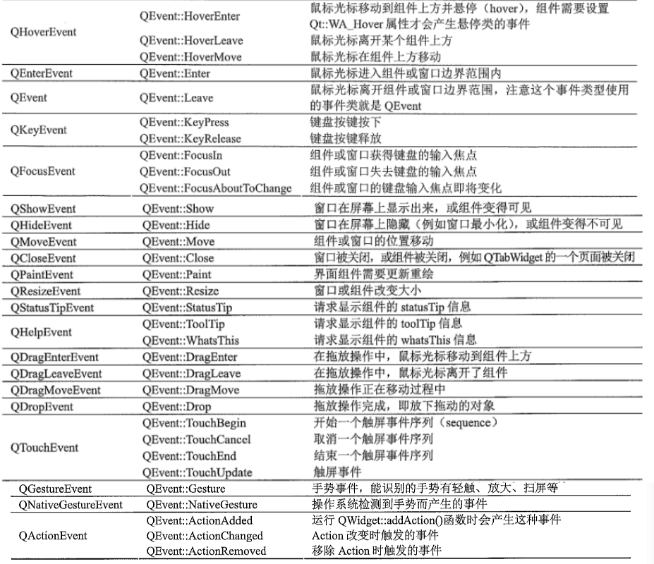
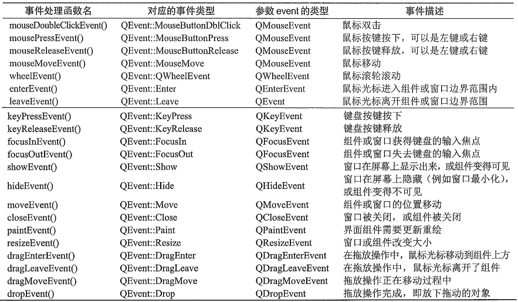

# 事件处理

## 事件系统

### 产生和派发

* **事件的产生**

  在Qt中，事件是对象，是QEvent类或其派生类的实例，按照来源可以分为三类

  * **自生事件**：由窗口系统产生的事件（如：QKeyEvent、QMouseEvent），**自生事件会进入系统队列**，然后会被应用程序的事件循环逐个处理
  * **发布事件**：由Qt或应用程序产生的事件（如：QTimer定时器发生定时溢出时自动发布的QTimerEvent），应用程序使用静态函数`QCoreApplicatoin::postEvent()`产生发布事件，**发布事件会进入Qt事件队列**，然后由应用程序的事件循环进行处理
  * **发送事件**：由Qt或应用程序定向发给某个对象的事件，应用程序使用静态函数`QCoreApplication::sendEvent()`产生发送时间，**由对象的`event()`函数直接处理**

  自生事件和发布事件处理是**异步的**

  ```c++
  void QCoreApplication::postEvent(QObject * receiver, QEvent * event, int priority = Qt::NormalEventPriority);
  ```

  receiver是接收事件的对象，event是事件对象，priority是事件的优先级

  而发送事件是同步模式进行的

  ```c++
  bool QCoreApplication::sendEvent(QObject * receiver, QEvent * event);
  ```

  **事件产生的流程**

  * **操作系统事件**

    1. 操作系统将获取的事件放入系统的消息队列中

    2. Qt事件循环的时候，读取消息队列中的消息转化为`QEvent`

    3. Qt事件产生后会被立即发送到相应的`QWidget`对象
    4. 相应的`QWidget`中的`QEvent *`进行事件处理
    5. `QEvent *`根据事件类型调用不同的事件处理函数
    6. 在事件处理函数中发送Qt预定义的信号
    7. 调用信号关联的槽函数

  * **Qt应用程序事件**

    程序产生事件有两种方式，一种是调用`QApplication::postEvent()`

    另一种方式是调用`sendEvent()`函数，**事件不会放入队列，而是直接被派发和处理**

    `sendEvent()`中事件对象的生命周期由Qt程序管理，**支持分配在栈上和堆上的事件对象**，`postEvent()`中事件对象的生命周期由Qt平台管理，**只支持分配在堆上的事件对象**，事件被处理后由Qt平台销毁

* **事件的调度**

  Qt的事件循环是**异步的**，当调用`QApplication::exec()`时，就进入了事件循环，先处理Qt事件队列中的事件，直到为空，在处理系统消息队列中的消息，直到为空，处理系统消息时，产生新的Qt事件，需要对其进行处理，**优先处理Qt事件**

  调用`QApplication::sendEvent`时，消息会立即被处理，是**同步的**，`QApplication::sendEvent()`是通过调用`QApplication::notify()`，直接进入事件的派发和处理阶段

* **事件的派发**

  > 事件过滤器是Qt中独特的事件处理机制，**通过事件过滤器，可以让一个对象侦听拦截另一个对象的事件**
  >
  > 在所有Qt对象的基类QObject中有一个类型为`QObjectList`的成员变量，名称为`eventFilters`
  >
  > 当某个A给另一个B安装了事件过滤器后，B会保存A的指针，在B处理事件前，会先检查`eventFilters`列表，如果非空，就会调用列表中对象的`eventFilter()`函数
  >
  > **事件过滤器按照安装次序的反序调用**，事件过滤器函数返回值是`bool`，`true`表示事件已经被处理完毕，Qt直接返回，进行下一个事件处理，`false`表示事件被送往剩下的事件过滤器处理

  Qt中事件派发是从`QApplication::notify()`开始的，因为QApplication继承自QObject，所以检查QApplication对象，如果有事件过滤器，那么先调用事件过滤器，接下来`QApplication::notify()`会过滤或合并一些事件，事件会被送到`reciver::event()`处理

  在`reciver::event()`中，先检查有无事件过滤器，如果有调用，然后根据QEvent类型，调用相应的特定事件处理函数

  应用程序的事件循环还可以**对队列中的相同事件进行合并处理**

  某些需要长时处理的事件，可以采用多线程或者**偶尔调用`QCoreApplication::processEvents()`，将事件队列中未处理的事件派发出去**

  ```c++
  void QCoreApplication::processEvents(QEventLoop::ProcessEventsFlags flags = QEventLoop::AllEvents);
  ```

  参数flags是标志类型`QEventLoop::ProcessEventsFlags`，是枚举类型`QEventLoop::EventsFlag`的组合

  默认值是`QEventLoop::AllEvents`，表示处理队列中的所有事件

  * `QEventLoop::AllEvents`：处理所有事件
  * `QEventLoop::ExcludeUserInputEvents`：排除用户输入事件
  * `QEventLoop::ExcludeSocketNotifiers`：排除网络Socket的通知事件
  * `QEventLoop::WaitForMoreEvents`：如果没有未处理的事件，等待更多事件

  QCoreApplication还有一个派发事件的静态函数`sendPostedEvents`

  ```c++
  void QCoreApplication::sendPostedEvents(QObject * receiver = nullptr, int event_type = 0);
  ```

  参数event_type是事件类型

  这个函数的功能是把前面用静态函数postEvent发送到Qt事件队列中的事件立即派发出去

### 事件类型

QEvent是所有事件类的基类，可以用来创建事件

```c++
void accept(); // 接收事件
void ignore(); // 忽略事件
bool isAccepted(); // 是否接收事件
bool isInputEvent(); // 事件对象是不是QInputEvent或派生类的实例
bool isPointerEvent(); // 事件是不是QPointerEvnet或派生类的实例
bool isSinglePointEvent(); // 事件是不是QSinglePointEvent或派生类的实例
bool spontaneous(); // 是不是自生事件
QEvent::Type type(); // 获取事件类型
```

函数type返回事件类型，返回值为枚举类`QEvent::Type`，每个事件都有唯一的事件类型，也有事件类，**但是事件类可以处理多种类型的事件**



### 事件处理

1. **事件处理的基本过程**

   任何从QObject派生的类都可以处理事件，**但其中主要从QWidget派生的窗口类和界面组件类需要处理事件**

   一个类接收到应用程序派发的事件后，首先由函数`event()`处理，event是QObject类中定义的虚函数

   ```c++
   bool QObject::event(QEvent * e);
   ```

   如果一个类重新实现了函数event，需要在函数中设置是否接收事件

   QEvent中有两个函数，accept接收事件，表示事件接收者会对事件进行处理，ignore忽略事件，表示事件接收者不接受此事件

   **被忽略的事件则传播到事件接收者的父容器组件，有父容器处理**，这被称为事件的传播

2. **QWidget类的经典事件处理函数**

   QWidget类对一些经典类型的事件定义了专门的事件处理函数，函数根据事件类型自动运行相应处理函数

   

## 事件和信号

事件和信号的区别在于，**事件通常由窗口系统或应用程序产生**，而**信号则是由Qt或者用户创建产生**，Qt为界面组件定义的信号通常是对事件的封装

### event函数

应用程序派发给界面组件的事件，首先会由其函数`event()`处理，如果event函数不进行处理，组件就会自动调用QWidget中与事件类型对应的默认事件处理函数

从QWidget派生的界面组件类一般不需要重新实现event函数，如果要对某种类型事件进行处理，可以重新实现对应事件处理函数

### 连接函数

```c++
connect(sender, signal, receiver, slot);
```

* `sender`是发出信号的对象
* `signal`是发送对象发出的信号
* `receiver`是接受信号的对象
* `slot`是接受到信号之后所需要调用的函数

当某个事件发生之后，`sender`会发送一个`signal`，这属于**广播**，如果有`receiver`对这个信号感兴趣，就会通过`connect`连接函数，使用自己的`slot`来处理这个信号

### 原生信号槽

Qt为每个Object都预先写好了一些信号和槽函数，可以直接使用他们来进行对象之间的连接

```c++
/**
 * 构造函数
 * @param parent 父类
 */
MainWindow::MainWindow(QWidget *parent) : QMainWindow(parent) {

    // 创建一个按钮
    QPushButton * button = new QPushButton("点击关闭窗口", this);
    // 调整按钮位置和大小
    button->move(0, 0);
    button->resize(200, 100);
    // 使用connect连接
    connect(button, &QPushButton::clicked, this, &QMainWindow::close);
}

/**
 * 析构函数
 */
MainWindow::~MainWindow() = default;

#include <QApplication>
#include "MainWindow.h"

int main(int argc, char *argv[]) {
    // 创建QApplication，用来初始化和管理对象
    QApplication a(argc, argv);
    // 创建主窗口，并显示
    MainWindow w;
    w.show();
    
    // 进入主事件循环
    return QApplication::exec();
}
```

上述代码主要演示`connect()`的用法

* `button`：类型是`QPushButton *`，由于发出信号的是按钮，所以`sender`处需要填入button对象指针
* `&QPushButton::clicked`：类型是`void *`，clicked是`QPushButton`类的成员函数，这个函数已经使用`Q_SIGNALS`转化为信号
* `this`：实际是该类所指具体的窗口，由于做出动作的对象是窗口，所以`receiver`处填窗口对象的指针
* `&QMainWindow::close`：类型是`bool *`，close是`QMainWindow`类的成员函数，这个函数已经使用`Q_SLOTS`转化为信号

### 自定义信号槽

```C++
class Tom : public QObject {
Q_OBJECT
public:
explicit Tom(QObject *parent = 0);
signals:
// 声明一个信号函数
void say();
};

class Jerry : public QObject {
Q_OBJECT
public:
explicit Jerry(QObject *parent = 0);
public slots:
// 声明一个槽函数
void run();
};

void Jerry::run() {
qDebug() << "溜了溜了\n" ;
}

class MainWindow : public QMainWindow {
Q_OBJECT
public:
// 定义两个对象指针，把Tom和Jerry变成自己的成员
Tom *tom;
Jerry *jerry;
MainWindow(QWidget *parent = 0);
~MainWindow();
// 声明一个函数，用来发起信号
void JerryEatFood();
};

MainWindow::MainWindow(QWidget *parent): QMainWindow(parent) {
// 创建Tom和Jerry
this -> tom = new Tom();
this -> jerry = new Jerry();
// 使用connect函数连接
connect(tom, &Tom::say, jerry, &Jerry::run);
JerryEatFood();
}
void MainWindow::JerryEatFood() {
// 调用该函数时，发现杰瑞在吃东西，同时Tom发起say的信号
qDebug() << "发现杰瑞在吃东西！\n";
emit tom -> say();
}
```

**继承了QObject，就需要在头文件中的第一行加上Q_OBJECT宏定义**

`signals:`是用来定义该类的信号，信号本质**是一个返回值为`void`的函数，不能在cpp中实现**

`slots:`是用来定义该类的槽函数，槽函数本质是**一个返回值为`void`的函数，可以在源文件中实现这个函数**

`emit`是Qt对C++的扩展关键字宏，**含义是发出信号，后面只需要跟一个对象的信号**

自定义信号槽的注意事项：

* **发送者和接受者都需要是QObject的子类**（Lambda表达式等无需接收者的时候除外）
* `signals`是一个函数声明，不需要实现
* 槽函数是普通成员函数，会受到访问权限符的限制
* 使用`emit`在合适的位置发送信号

## 事件过滤器

### 事件过滤器工作原理

QObject还提供了另一个 中处理事件的方法：事件过滤器，它可以将一个对象的事件委托给另一个对象俩监视并处理

要实现事件过滤器功能，需要完成两个操作

1. 被监视对象使用函数`installEventFilter()`将自己注册给监视对象，监视对象就是事件过滤器
2. 监视对象重新实现函数`eventFilter()`，对监视到的事件进行处理

两个函数都是QObject类定义的公有函数

```c++
void QObject::installEventFilter(QObject * filterObj);

bool QObject::eventFilter(QObject * watched, QEvent * event);
```

参数watched是被监视对象，event是产生的事件，返回值**如果为true，事件就不会传播给其他对象，如果为false，事件就会继续传播给事件接收者处理**

## 事件处理过滤

Qt提供了五种不同级别的事件处理和过滤

* **重写特定事件处理函数**

* **重写`event()`函数**

  重写时需要调用父类的`event()`函数来处理不需要处理或不清楚如何处理的事件

* **在Qt对象中安装事件过滤器**

  首先调用B的`installEventFilter(const QObject * obj)`，以A的指针作为参数，所有发往B的事件都将先由A的`eventFiter()`处理，然后A需要重写`QObject::eventFitler()`函数

* **给QApplication对象安装事件过滤器**

  给QApplication安装过滤器，那么所有事件在发往其他过滤器之前，都会经过当前的过滤器

* **继承QApplication类，并重载notify()函数**

  Qt用`QApplication::notify()`函数分发事件，要在任何事件过滤器之前处理事件，重写`notify()`是唯一方法
  
  

