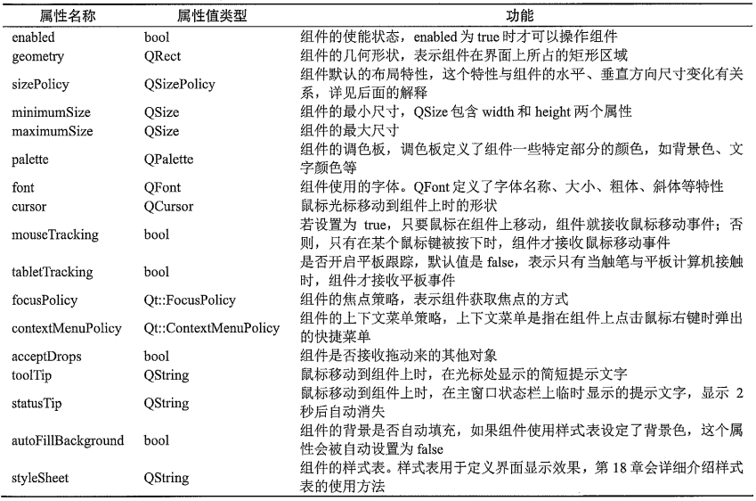
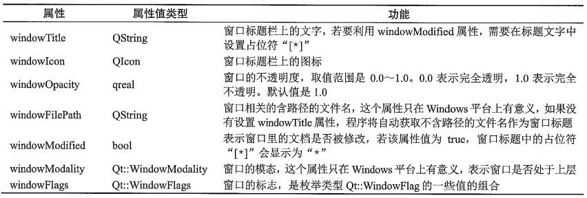

# 常见界面组件

所有界面组件类都直接或间接继承父类`QWidget`，`QWidget`的父类是`QObject`和`QPaintDevice`

## 概述

### 常用界面组件

* **按钮类组件**

  

  `QCommandLinkButton`用于多个互斥项的选择

  `QDialogButtonBox`是一个符合组件类，可以设置为多个按钮的组合

* **输入类组件**

  

* **显示类组件**

  

* **容器类组件**

  

### QWidget主要属性和接口函数

* **QWidget作为界面组件时的属性**

  
  
  sizePolicy属性是QSizePolicy类型，定义了组件在水平和垂直方向的尺寸变化策略，Horizontal Policy表示组件在水平方向的尺寸变化策略，Vertical Policy表示组件在垂直方向的尺寸变化策略，其值都为枚举类型`QSizePolicy::Policy`
  
  * `QSizePolicy::Fixed`：固定尺寸
  * `QSizePolicy::Minimum`：最小尺寸
  * `QSizePolicy::Maximum`：最大尺寸
  * `QSizePolicy::Preferred`：首选尺寸
  * `QSizePolicy::Expanding`：可扩展尺寸
  * `QSizePolicy::MinimumExpanding`：最小可扩展，设置为最小值，但是可以扩展
  * `QSizePolicy::Ignored`：忽略尺寸，占据尽可能大的空间
  
* **QWidget作为窗口时的属性**

  

* **QWidget其他接口函数**

  ```c++
  bool close();					// 关闭窗口
  void hide();					// 隐藏窗口
  void show();					// 显示窗口
  void showFullScreen();			// 以全屏方式显示窗口
  void showMaximized();			// 窗口最大化
  void showMinimized();			// 窗口最小化
  void showNormal();				// 恢复正常
  
  // 信号
  void custmContextMenuRequested(const QPoint & pos);
  void windowIconChanged(const QIcon & icon);
  void windowTitleChanged(const QString & title);
  ```

  

