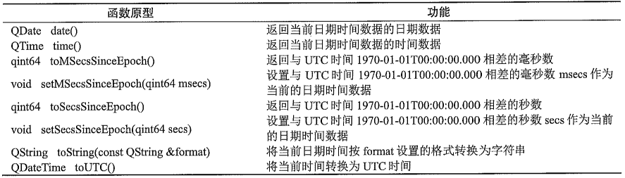
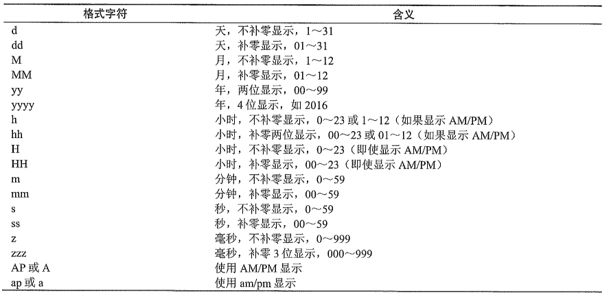
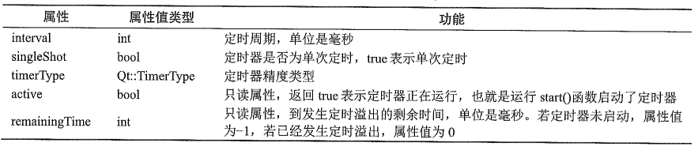
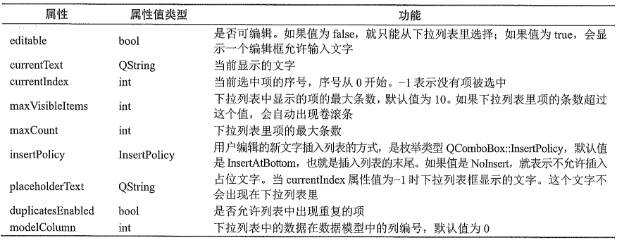
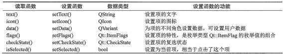
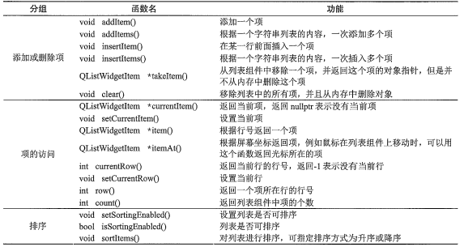

# 常见界面组件

所有界面组件类都直接或间接继承父类`QWidget`，`QWidget`的父类是`QObject`和`QPaintDevice`

## 概述

### 常用界面组件

* **按钮类组件**

  

  `QCommandLinkButton`用于多个互斥项的选择

  `QDialogButtonBox`是一个符合组件类，可以设置为多个按钮的组合

* **输入类组件**

  

* **显示类组件**

  

* **容器类组件**

  

### QWidget

* **QWidget作为界面组件时的属性**

  
  
  sizePolicy属性是QSizePolicy类型，定义了组件在水平和垂直方向的尺寸变化策略，Horizontal Policy表示组件在水平方向的尺寸变化策略，Vertical Policy表示组件在垂直方向的尺寸变化策略，其值都为枚举类型`QSizePolicy::Policy`
  
  * `QSizePolicy::Fixed`：固定尺寸
  * `QSizePolicy::Minimum`：最小尺寸
  * `QSizePolicy::Maximum`：最大尺寸
  * `QSizePolicy::Preferred`：首选尺寸
  * `QSizePolicy::Expanding`：可扩展尺寸
  * `QSizePolicy::MinimumExpanding`：最小可扩展，设置为最小值，但是可以扩展
  * `QSizePolicy::Ignored`：忽略尺寸，占据尽可能大的空间
  
* **QWidget作为窗口时的属性**

  

* **QWidget其他接口函数**

  ```c++
  bool close();					// 关闭窗口
  void hide();					// 隐藏窗口
  void show();					// 显示窗口
  void showFullScreen();			// 以全屏方式显示窗口
  void showMaximized();			// 窗口最大化
  void showMinimized();			// 窗口最小化
  void showNormal();				// 恢复正常
  
  // 信号
  void custmContextMenuRequested(const QPoint & pos);
  void windowIconChanged(const QIcon & icon);
  void windowTitleChanged(const QString & title);
  ```


## 布局管理

### 相关类

Layouts分组中的4个组件对应的布局管理类都继承自QLayout类，QLayout的父类是QObject和QLayoutItem，**因为没有继承自QWidget，所以不会在窗口可见**

* **QVBoxLayout**：垂直布局
* **QHBoxLayout**：水平布局
* **QGridLayout**：网格布局
* **QFormLayout**：表单布局
* **QStackedLayout**：堆叠布局，用于管理多个QWidget类对象，但任何时候只有一个页面可见

### 代码原理

* **水平布局**

  水平布局的`layoutStretch`可以控制组件的宽度占比，通过设置比如1,2,1表示，三个组件的占比，还可以通过设置单个组件的sizePolicy属性中的`Horizontal Stretch`来实现

* **网络布局**

  网格布局特有属性

  * `layoutHorizontalSpacing`：水平上组件的最小间距
  * `layoutVerticalSpacing`：垂直方向上组件的最小间距
  * `layoutRowStretch`：各行的延展因子，与垂直布局的layoutStretch属性功能相同
  * `layoutColumnStretch`：各列的延展因子
  * `layoutRowMinimumHeight`：各行的最小高度，0为自动设置
  * `layoutColumnMinimumWidth`：各列的最小宽度，0为自动设置
  * `layoutSizeConstraint`：布局的尺寸限制方式，其值为模具类型`QLayout::SizeConstraint`，默认设置为`QLayout::setDefaultConstraint`，也就是将父组件的最小尺寸作为网格布局的最小尺寸

  网格布局通过`addWidget()`添加组件，原型如下

  ```c++
  void QGridLayout::addWidget(QWidget * widget, int fromRow, int fromColumn ,int rowSpan, init columnSpan, Qt::Alignment aligment = Qt::Alignment());
  ```

* **分割条**

  可以实现水平或垂直分割，一般实在两个可以自由改变大小的组件之间进行分割

  可以通过使用`QMainWindow::setCentralWidget()`将其设置为主窗口的中心组件

  QSplitter属性

  * `orientation`：方向
  * `opaqueResize`：如果是true，表示拖动分割条时，组件动态改变大小
  * `handleWidth`：进行分割操作的拖动条的宽度
  * `childrenCollapsible`：进行分割操作时，子组件的大小是否可以变为0

## QString字符串

QString没有父类，存储字符，QChar类型，使用UTF-16编码

QString通过使用静态方法`fromUtf8()`将`const char *`类型的参数变为QString对象

### QChar

**主要函数**


### 常用操作

* **拼接**

  使用加号可以将两个QString字符串拼接为一个

  函数`append()`在当前字符串后面添加字符串，函数`prepend()`在当前字符串的前面添加字符串

* **字符串截取**

  函数`front()`和`back()`，front返回第一个字符，back返回最后一个字符

  函数`left()`和`right()`，left从字符串左边提取n个字符，right从右边提取

  函数`first()`和`last()`，first从字符串提取最前面n个字符，last从最后面提取，**first和last效率高于left和right**

  函数`mid()`，用于返回字符串中的部分字符串

  ```c++
  QString QString::mid(qsizetype pos, qsizetype n = -1);
  ```

  其中post表示起始位置，n表示返回字符串中的字符个数，如果超过边界返回nullptr

  函数`sliced()`，和mid功能相同，有两种不同的参数形式，如果超过边界报错，正常情况下效率高于mid

  函数`section()`

  ```c++
  QString QString::section(const QString &sep, qsizetype start, qsizetype end -1, QString::SectionFlags flags = SectionDefault);
  ```

  用于提取以`seq`作为分割符，从start到end的字符串

* **存储**

  函数`isNull()`和`isEmpty()`判断字符串是否为空，但是如果只有一个`\0`，isNull返回false，而isEmpty返回true

  函数`count()`、`size()`和`length()`，size和length功能相同，不带参数的count也相同，count可以带有参数，统计某个字符的出现次数

  函数`clear()`，清空当前字符串，使字符串为null

  函数`resize()`，改变字符串长度，如果参数size大于字符串的当前长度，进行扩容，**但是新增的字符是不确定的**，但是**size小于字符串的当前长度，字符串会缩短为size，多余的丢失**

  函数`fill()`，将字符串中的每个字符都用一个新的字符替换，可以改变字符串的长度

* **搜索和判断**

  函数`indexOf()`和`lastIndexOf()`，实在当前字符串内查找某个字符串首次出现的位置

  ```c++
  qsizetype QString::indexof(const QString & str, qsizetype from = 0, Qt::CaseSensitivety cs = Qt::CaseSensitive);
  ```

  参数cs指定是否区分大小写，`Qt::CaseInsensitive`表示不区分大小写

  函数`contains()`，判断当前字符串是否包含某个字符串，可指定是否区分大小写

  函数`endsWith()`和`startsWith()`，判断是否以某个字符串开头或结束

* **转换和修改**

  函数`toUpper()`和`toLower()`，将字符串的字母全部转换为大写字母，或者小写

  函数`trimmed()`和`simplified()`，trimmed会取消字符串首尾的空格，simplified不仅删除首位空格，还会将中间连续的空格转化为单个空格

  函数`chop()`，用来去掉字符串末尾的n个字符串

  函数`insert()`，用来在某个位置插入一个字符串，返回字符串对象的引用，pos长度大于字符串长度，会用空格扩充长度

  函数`replace()`

  ```c++
  QString & QString::replace(qsizetype pos, qsizetype n, const QString & after);
  QString & QString::replace(QChar before, QChar after, Qt::Casesensityvity cs = Qt::CaseSensitive);
  ```

  函数`remove()`，从pos位置开始移除n个字符，或者移除字符串中某个字符

### 与数值转换

* **转化为整数**

  `toInt()`、`toUInt()`、`toLong`、`toULong()`、`toShort()`、`toUShort()`、`toLongLong()`、`toULongLong()`

  参数1是`bool * ok`，如果不为nullptr，则作为转换是否成功的返回值

  参数2是`int base`，表示使用的进制，默认为10

* **转换为浮点数**

  `toFloat()`、`toDouble()`

* **函数setNum()**

  用于将整数或浮点数转换为字符串，为重载型函数，有很多参数类型

  ```c++
  QString & setNum(int n, int base = 10);
  ...
  QString & setNum(double n, char format = 'g', int precision = 6);
  ...
  ```

  format是格式字符，precision表示精度位数

  

* **静态函数number()**

  参数形式和功能与成员函数setNum()相似

* **静态函数asprintf()**

  用于构造格式化输出各种数据的字符串

* **函数arg()**

  用于格式化输出各种数据的字符串

  ```c++
  Qstring arg(int a, int fieldWidth = 0, int base = 10, QChar fillChar = QLatin1Char(' '));
  ```

  参数a表示要转换为字符串的整数

  参数fieldWidth是转换成的字符串占用的最少空格数

  参数base是转换成的字符串显示进制，默认10

  参数fillChar是当fieldWidth大于实际宽度时的填充，默认空格

## QSpinBox


QSpinBox有两个特有的信号

```c++
void QSpinBox::valueChanged(int i);
void QSpinBox::textChanged(const QString & text);
```

## 按钮组件

### 按钮属性


QPushButton新增了属性


只有当按钮所在窗口基类QDialog时，autoDefault和defualt属性才有意义

QCheckBox增加了一个`tristate`属性，表示是否允许有3种复选状态，及除了Checked和Unchecked还有`PartiallyChecked`

### 按钮信号

```c++
void clicked(bool checked = false);
void pressed();
void released();
void toggled(bool checked);
```

## QSlider和QProgressBar

### QAbstractSlider属性


### QAbstractSlider信号

```c++
void actionTriggered(int action); // 滑动条触发动作
void rangeChanged(int min, int max); // 最大值最小值改变
void sliderMoved(int value); // 用户按爪鼠标拖动滑块
void sliderPressed();
void sliderReleased();
void valueChanged(int value);s
```

### QSlider

新增属性

* `tickPosition`：标尺刻度的显示位置
* `tickInterval`：标尺刻度的间隔值

### QProgressBar

表示进度组件，百分比数据显示进度

* `textDirectioin`：文字的方向
* `format`：显示文字的格式，%p%显示百分比，%v显示当前值，%m显示总步数

## 日期时间数据

### QTime


### QDate


### QDateTime



### 日期事件转字符串

通过`toString()`，将日期时间转换为字符串

```c++
QString QDateTime::toString(const QString & format, QCalendar cal = QCanlendar());
```

参数format表示格式化字符，cal是日历类型

静态函数`QDateTime::fromString()`用于将字符串转换为日期时间

```c++
QDateTime QDateTime::fromString(const QString & string, const QString & format, QCalendar cal = QCalendar());
```



### QTimer

父类是QObject，设置以毫秒为单位的定时周期，然后连续定时或单次定时

**定时溢出后QTimer会发射`timeout()`信号**

QElapsedTimer用于精确的确定程序运行的时长

* **QTimer主要属性和接口函数**

  

  属性timeType表示定时器的精度类型

  ```c++
  void QTimer::setTimerType(Qt::TimerType atype);
  ```

  `Qt::TimerType`为枚举值，默认是`Qt::CoarseTimer`

  * `Qt::PreciseTimer`精准定时器，毫秒级别
  * `Qt::CoarseTimer`粗糙定时器，误差在定时周期值的5%内
  * `Qt::VeryCoarseTimer`非常粗糙定时器，秒级

  QTimer共有槽函数

  ```c++
  void QTimer::start();
  void QTimer::start(int msec); // 设置周期，毫秒
  void QTimer::stop();
  ```

  **静态函数singleShot()**

  用于创建和启动单次定时器，并将timeout信号和指定的槽函数关联

  ```c++
  void QTimer::singleShot(int msec, Qt::TimerType timerType, const QObject * receiver, const char * member);
  ```

  后两个参数是接收信号对象，和对应槽函数

### QElapsedTimer

用于快速计算两个事件间隔事件

```c++
void start();
qint64 elapsed(); // 返回流逝事件毫秒
qint64 nsecsElapsed(); // 返回流逝事件纳秒
qint64 restart(); // 重新启动计时器
```

## QComboBox



```c++
void activeated(int index);
void currentIndexChanged(int index);
void currentTextChanged(const QString & text);
void editTextChanged(const QString & text);
void highlighted(int index);
void textActivated(const QString & text);
void textHighlighted(const QString & text);
```

## QMainWindow

### QAction

QAction的大部分属性用来属性读写的函数

* **信号**

  ```c++
  void changed(); // text、toolTip、font等属性改变时
  void checkableChanged(bool checkable);
  void enabledChanged(bool enabled);
  void hovered(); // 鼠标移动到此Action创建的菜单项或工具按钮上时
  void toggled(bool checked); // checked属性变化时
  void triggered(bool checked = false); // 点击Action的菜单项或工具按钮时
  void visibleChanged(); // visible属性值变化时
  ```

* **共有槽**

  ```c++
  void hover(); // 触发hovered信号
  void trigger(); // 触发triggered信号
  void resetEnabled(); // 复位enabled属性为默认值
  void setChecked(bool);
  void setDisabled(bool);
  void setEnabled(bool);
  void setVisible(bool);
  void toggle(); // 反转checked值
  ```

### QToolBar

```c++
void addAction(QAction *action);
QAction *addWidget(QWidget *widget);
QAction *insertWidget(QAction *before, QWidget *widget);
QAction *addSeparator();
QActoin *insertSeparator(QAction *before);
```

### QStatusBar

**不能在状态栏放置组件，只能通过其接口函数向状态栏添加组件**

```c++
void addWidget(QWidget *widget, int stretch = 0);
void addParmanentWidget(QWWidget *widget, int stretch = 0);
```

QStatusBar有两个公有槽，可以显示和清除临时消息

```c++
void showMessage(const QString &message, int timeout = 0);
void clearMessage();
```

`showMessege()`用于在状态栏上左端个位置显示字符串信息，显示持续时间是timeout，单位是毫秒，如果timeout设置为0，就一直显示，知道被清除或者下一条消息替换

**使用`showMessage()`显示临时消息时，状态栏使用`addWidget()`会掩盖，而是用`addParmanentWidget()`不会**

## QToolButton

QToolButton属性，属性值是枚举类`QToolButton::ToolButtonPopupMode`，当有按钮有下拉菜单时，这个属性决定了弹出菜单的模式

* `QToolButton::DelayedPopup`：按钮上没有任何附加的显示内容，如果按钮有下拉菜单，会延时一段时间再打开
* `QToolButton::MenuButtonPopup`：会在按钮右侧显示要给带箭头的下拉按钮，点就下拉才会展示菜单，点击按钮会执行绑定的QAction
* `QToolButton::InstantPopup`：会掩盖绑定的QAction而是执行下拉菜单

toolButtonTyle属性是枚举类型`Qt::ToolButtonStyle`表示工具按钮上文字和图标的显示方式

autoRaise属性，如果被设置为true，按钮就没有边框，鼠标移动到按钮上才会显示边框

arrowType属性，属性值是枚举类型`Qt::ArrowType`，默认值是`Qt::NoArrow`，不会再按钮上显示内容

`setDefaultAction()`函数，用于为工具按钮设置关联的Action，被设置关联的Action后，工具按钮的文字、图标、toolTip等属性会跟Action相同，**工具按钮的triggered信号会自动关联Action的triggered信号**

```c++
void QToolButton::setDefualtAction(QAction * action);
```

`setMenu()`函数，用于为工具按钮设置下拉菜单，

```c++
void QToolButton::setMenu(QMenu * menu);
```

## QListWidget

* **QListWidgetItem主要接口函数**

  

* **QListWidget主要接口函数**

  

QlistWidget组件的每一行是要给QListWidgetItem对象，要在列表中添加项，需要创建一个QListWidgetItem，然后将其添加到对象中

QListWidgetItem的函数`setFalgs()`用于设置项的特性

```c++
void QListWidgetItem::setFlags(Qt::ItemFlags falgs);
```

QListWidget的`takeItem()`知识从列表移除一个项，并不是删除QListWidgetItem，需要通过delete显示删除

sortingEnable属性，表示列表是否可排序，默认为false，但是**还是可以通过`sortItems()`进行列表排序**，如果为true，**add和insert的新增项回到列表最前方**，所以为了保证添加正确性，应该设置为false

使用函数`sortItems()`可以对列表进行排序

```c++
void QListWidget::sortItems(Qt::SortOrder order = Qt::AscendingOrder);
```

参数order表示排序方式，是枚举类型`Qt::SortOrder`，其中`Qt::AscendingOrder`表示升序，`Qt::DescendingOrder`表示降序

**QListWidget信号**

```c++
void currentItemChanged (QListWidgetItem *current, QListWidgetItem *previous);
void currentRowChanged(int currentRow);
void currentTextChanged (const QString &currentText);
void itemSelectionChanged(); //表示选择的项发生了变化
void itemChanged (QListWidgetItem *item);
void itemActivated (QListWidgetItem *item); // 光标停留在某个项，输入Enter发送信号
void itemEntered (QListWidgetItem *item); // 鼠标跟踪时
void itemPressed (QListWidgetItem *item); // 鼠标按下
void itemClicked (QListWidgetItem *item); // 点击
void itemDoubleClicked (QListWidgetItem *item; // 双击
```

## 创建右键菜单

每个继承自QWidget的累都有`customContextMenuRequested()`信号，在一个组件上点击鼠标右键时，发送信号

```c++
void QWidget::setContextMenuPolicy(Qt::ContextMenuPolicy policy);
```

参数policy时枚举类型`Qt::ContextMenuPolicy`

* `Qt::NoContextMenu`：组件没有快捷菜单，由父容器组件处理
* `Qt::PreventContextMenu`：阻止快捷菜单，并且点击鼠标右键事件不会交给父类容器处理
* `Qt::DefaultContextMenu`：默认的快捷菜单，组件的 `QWidget::contextMenuEvent()`自动处理，调用某些组件的默认快捷菜单
* `Qt::ActionsContextMenu`：自动根据`QWidget::action()`返回的Action列表创建并显示快捷菜单
* `Qt::CustomContextMenu`：组件发出`customContextMenuRequested()`信号，由用户自定义快捷菜单

## QTableWidget

### QTableWidget

```c++
void insertColumn(int column); // 在列号为column的位置插入空列
void removeColumn(int column);
void insertRow(int row);
void removeRow(int row);
```

QTableWidget表格中的一个单元格关联一个QTableWidgetItem对象

通过函数`setItem()`设置其属性

```c++
void setItem(int row, int column, QTableWidgetItem * item);
```

QTableWidget定义了两个公有槽，用来清楚整个表格或所有单元格的项

```c++
void clear();
void clearContents();
```

QTableWidget表格数据区有一个当前单元格，可以返回当前单元格的行号和列号

```c++
int currentRow();
int currentColumn();
void setCurrentCell(int row, int column);
```

当前单元格关联的QTableWidgetItem对象就是当前项，可以返回当前项的对象指针

```c++
QTableWidgetItem * currentItem();
void setCurrentItem(QTableWidgetItem * item);
```

每个单元格绑定一个项后，可以通过表格行号列号获取这个单元格的项

```c++
QTableWidgetItem * item(int row, int column);
int row(const QTableWidgetItem * item);
int column(const QTableWidgetItem * item);
```

水平表头的每个单元格可以设置一个项目

```c++
void setHorizontalHeaderItem(int column, QTableWidgetItem * item);
QTableWidgetItem * horizontalHeaderItem(int column);
QTableWidgetItem * takeHorizontalHeaderItem(int column);
```

**如果只需要设置文字不需要特殊格式，可以简化**

```c++
void setHorizontalHeaderLabels(const QStringList & labels);
```

默认情况下，垂直表头会自动显示行号，垂直表头的每个单元格可以设置一个项或者直接设置文字

```c++
void setVerticalHeaderItem(int row, QTableWidgetItem * item);
QTableWidgetItem * verticalHeaderItem(int row);
QTableWidgetItem * takeVerticalHeaderItem(int row);
void setVerticalHeaderLabels(const QStringList &labels);
```

**QtableWidget信号**

```c++
void cellActivated(int row, int column); // 单元格被激活
void cellChanged (int row, int column); // 数据更改
void cellClicked(int row, int column);
void cellDoubleClicked (int row, int column);
void cellEntered (int row, int column);
void cellPressed(int row, int column);
void currentCellChanged(int currentRow, int currentColumn, int previousRow,int previousColumn);
void itemActivated (QTableWidgetItem *item);
void itemChanged (QTableWidgetItem *item);
void itemClicked (QTableWidgetItem *item);
void itemDoubleClicked (QTableWidgetItem *item);
void itemEntered (QTableWidgetItem *item);
void itemPressed (QTableWidgetItem *item);
void currentItemChanged (QTableWidgetItem *current, QTableWidgetItem *previous);
void itemSelectionChanged();
```

### QTableWidgetItem

QTableWidgetItem构造函数

```c++
QTableWidgetItem(const QIcon & icon, const QString & text，int type = Type);
QTableWidgetItem(const QString &text, int type = Type);
QTableWdigetItem(int type = Type);
```

QTableWidgetItem操作相关函数

```c++
int row();
int column();
void setSelected(bool select);
bool isSelected();
QTableWidget * tableWidget();
```
